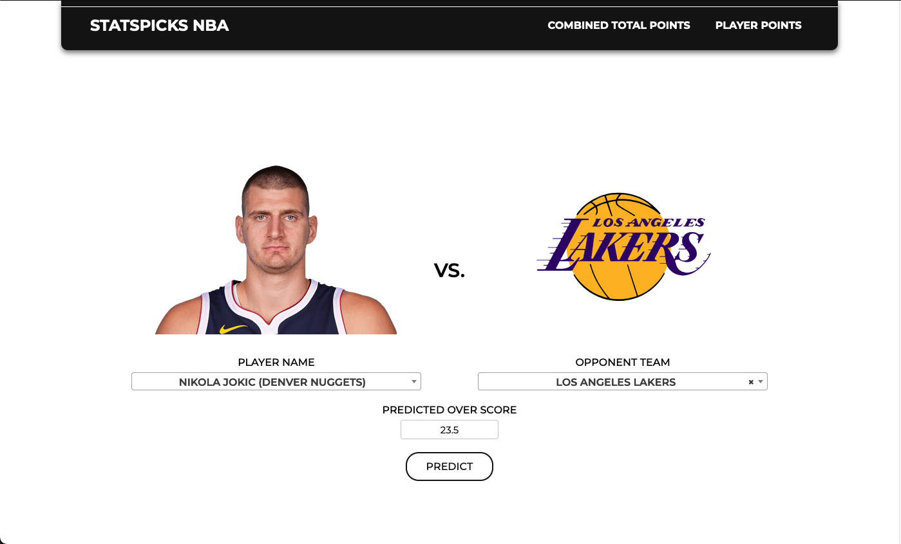

# StatsPicksNBA
A Django web application leveraging machine learning algorithms to help make predictions related to NBA betting over/under lines for player and team props.



Project Setup Guide

Follow these steps to set up your project environment and run the web server:

Setting Up the Environment
1. Create a virtual environment:
   ```
   python3 -m venv venv
   ```

2. Activate the virtual environment:
   For detailed instructions on activating your virtual environment, see the official Python venv documentation at https://docs.python.org/3/library/venv.html. Typically, you activate it with:
   ```
   source venv/bin/activate
   ```

3. Install project requirements:
   ```
   pip install -r requirements.txt
   ```

Database Setup


4. Create database migrations:
   ```
   python manage.py makemigrations
   ```

5. Apply database migrations:
   ```
   python manage.py migrate
   ```

6. Load initial data for teams:
   ```
   python manage.py loaddata teams.json
   ```

7. Load initial data for players:
   ```
   python manage.py loaddata players.json
   ```

Running the Server


8. Start the web server:
   ```
   python manage.py runserver
   ```

9. Access the web application:
   Once the server is running, open your web browser and navigate to:
   URL: http://127.0.0.1:8000

Happy Coding!
